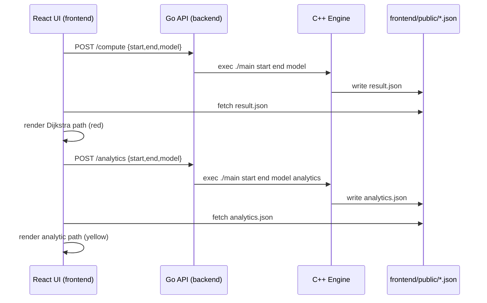

# Geodesic Lab

This project computes and visualizes shortest‑path approximations on 3D meshes using a C++ engine, a Go API server, and a React + Three.js frontend.

## System Flow (End‑to‑End)

### Run Dijkstra

1. You click **Run Dijkstra** in the UI.
2. The React app sends a POST request to the Go server at /compute.
3. The Go server runs the C++ engine binary in [main.cpp](main.cpp) with arguments: startId, endId, model path.
4. The C++ engine loads the OBJ, builds a graph, runs Dijkstra, and writes result.json.
5. The React app fetches result.json and renders the path in red.

### Run Analytics

1. You click **Run Analytics** in the UI.
2. The React app sends a POST request to the Go server at /analytics.
3. The Go server runs the C++ engine with mode analytics.
4. The C++ engine calls the analytic solver in [analytics.hpp](analytics.hpp) and writes analytics.json.
5. The React app fetches analytics.json and renders the path in yellow.

### Diagram

## Core Algorithms

### 1) Dijkstra on the Mesh Graph

We treat mesh vertices as nodes and edges as graph edges. Each edge weight is the Euclidean length between adjacent vertices. The algorithm computes the shortest path along edges only.

Given a graph $G=(V,E)$ with edge weights $w(u,v)$, Dijkstra computes distances:

$$
d(s)=0,\quad d(v)=\min_{(u,v)\in E}\{d(u)+w(u,v)\}
$$

The path is then recovered by parent pointers.

Implementation: [main.cpp](main.cpp)

### 2) Analytic Geodesics (Parametric Surfaces)

The analytic solver in [analytics.hpp](analytics.hpp) uses closed‑form or ODE solutions for special surfaces:

#### Plane

Geodesic is a straight line:
$$\gamma(t)=(1-t)p_0 + t p_1$$

#### Sphere

Geodesic is a great‑circle arc. Let $\hat a,\hat b$ be unit vectors and $\theta=\arccos(\hat a\cdot \hat b)$. Then:
$$\gamma(t)=\frac{\sin((1-t)\theta)}{\sin\theta}\hat a + \frac{\sin(t\theta)}{\sin\theta}\hat b$$

#### Torus / Saddle (Numerical Geodesics)

For torus and saddle, we integrate the geodesic ODE in parameter coordinates $(u,v)$ using a shooting method + RK4:

$$
\frac{d^2 x^k}{dt^2} + \sum_{i,j}\Gamma^k_{ij}\frac{dx^i}{dt}\frac{dx^j}{dt} = 0
$$

where the Christoffel symbols $\Gamma^k_{ij}$ are derived from the surface metric.

Implementation: [analytics.hpp](analytics.hpp)

## Current Limitations

### No Analytic Geodesics on Arbitrary Meshes

The analytic solver only works for a small set of parametric surfaces. It does **not** compute geodesics on irregular meshes like the Stanford bunny.

### Why the Heat Method Is Needed

For general triangle meshes, the standard approach is the **Heat Method** (see [1]).

The idea:

1. Solve the heat equation for a short time $t$.
2. Normalize the temperature gradient to get a vector field $X$.
3. Solve a Poisson equation $\Delta \phi = \nabla\cdot X$.
4. $\phi$ approximates geodesic distance; follow its gradient to extract a path.

This method is fast, robust, and works on **any** triangle mesh, which is why it’s the right next step for bunny and other irregular models.

## Project Files (Key Pieces)

- C++ engine: [main.cpp](main.cpp)
- Analytic solver: [analytics.hpp](analytics.hpp)
- Go API server: [backend/main.go](backend/main.go)
- React + Three.js UI: [frontend/src/App.tsx](frontend/src/App.tsx)
- Renderer: [frontend/components/GeodesicMesh.tsx](frontend/components/GeodesicMesh.tsx)

## References

[1] [Crane, K., Weischedel, C. and Wardetzky, M. (2013). _Geodesics in heat: A new approach to computing distance based on heat flow_. ACM Transactions on Graphics, 32(5), pp.1–11.](https://www.cs.cmu.edu/~kmcrane/Projects/HeatMethod/paperCACM.pdf)
